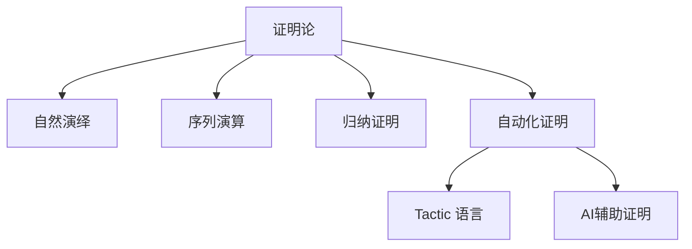

# 1.9 证明论与推理系统 / Proof Theory and Reasoning Systems

[返回目录](../CONTINUOUS_PROGRESS.md) | [上一节: 1.8-类型论理论模型.md](1.8-类型论理论模型.md)

---

## 1.9.1 证明论发展简史 / Historical Overview of Proof Theory

- 20世纪初由Hilbert等提出，研究形式系统中的证明结构与推理规则
- 发展出自然演绎、序列演算、归纳证明等多种体系
- 证明论成为现代定理证明器（Lean、Coq、Agda）的理论支柱

---

## 1.9.2 自然演绎与序列演算 / Natural Deduction and Sequent Calculus

### 自然演绎（Natural Deduction）

- 以引入/消解规则模拟人类直觉推理
- 证明树结构

### 序列演算（Sequent Calculus）

- 采用序列（$\Gamma \vdash \Delta$）表示推理状态
- 强调结构规则和归约过程

**Lean 代码示例：**

```lean
lemma imp_trans (A B C : Prop) : (A → B) → (B → C) → (A → C) :=
  λ h₁ h₂ a => h₂ (h₁ a)

structure Sequent (Γ Δ : List Prop) :=
  (left : List Prop)
  (right : List Prop)
```

---

## 1.9.3 归纳证明与递归原理 / Inductive Proofs and Recursion Principle

- 数学归纳法、结构归纳法广泛用于自然数、数据结构等的性质证明
- Lean 支持递归定义与归纳证明

**Lean 代码示例：**

```lean
lemma add_zero (n : Nat) : n + 0 = n :=
  Nat.recOn n rfl (λ n ih => congrArg Nat.succ ih)
```

---

## 1.9.4 自动化证明与策略 / Automated Proofs and Tactics

- Lean 的 tactic 语言支持自动化证明、归纳、化简、搜索等
- 用户可自定义 tactic 组合，实现高效证明

**Lean 代码示例：**

```lean
example (a b : Nat) : a + b = b + a :=
  by simp [Nat.add_comm]
```

---

## 1.9.5 Lean中的证明系统与创新 / Proof Systems and Innovations in Lean

- 支持自然演绎、序列演算、归纳证明、自动化策略等多种体系
- AI辅助证明、可解释性证明、证明可视化等前沿方向
- 与Coq、Agda等系统的证明机制对比

---

## 1.9.6 图表与多表征 / Diagrams and Multi-Representation



---

## 1.9.6 创新建议 / Innovation Suggestions

- 中文：探索AI驱动的自动化证明、神经符号推理、交互式证明可视化等新方向。
- English: Explore new directions such as AI-driven automated proofs, neuro-symbolic reasoning, and interactive proof visualization.

## 1.9.7 工程案例 / Engineering Case

- 中文：在工业级安全协议验证、复杂系统归纳证明自动化等领域的应用。
- English: Applications in industrial-grade security protocol verification and automation of inductive proofs for complex systems.

## 1.9.8 前沿趋势 / Frontiers and Trends

- 中文：大模型辅助证明、证明搜索优化、自动化策略生成。
- English: Large language model-assisted proofs, proof search optimization, and automated strategy generation.

## 1.9.9 AI辅助与多模态表达 / AI Assistance and Multi-Modal Representation

- 中文：结合AI自动生成证明脚本、可视化证明树，支持Latex、Mermaid、Lean/Coq代码多模态表达。
- English: Integrate AI to automatically generate proof scripts and visualize proof trees, supporting multi-modal representation with Latex, Mermaid, and Lean/Coq code.

---

## 1.9.7 交叉引用 / Cross References

- [1.2-lean-类型系统与证明系统.md](1.2-lean-类型系统与证明系统.md)
- [1.8-类型论理论模型.md](1.8-类型论理论模型.md)
- [1.10-模型论与语义模型.md](1.10-模型论与语义模型.md)

## 1.9.10 证明论的语义基础 / Semantic Foundations of Proof Theory

- 中文：证明论关注形式系统中证明结构的语义解释，包括命题、推理规则与证明对象的对应关系。
- English: Proof theory focuses on the semantic interpretation of proof structures in formal systems, including the correspondence between propositions, inference rules, and proof objects.

## 1.9.11 Lean中的自然演绎与序列演算 / Natural Deduction & Sequent Calculus in Lean

- 中文：Lean 支持自然演绎与序列演算的形式化建模，可通过 inductive 类型和 tactic 语言实现推理规则与证明树。
- English: Lean supports formal modeling of natural deduction and sequent calculus, using inductive types and tactics to implement inference rules and proof trees.

**Lean 代码示例 / Lean Code Example**：

```lean
inductive Sequent : Type
| ax : Prop → Sequent
| cut : Sequent → Sequent → Sequent
```

## 1.9.12 归纳与共递归证明 / Inductive & Coinductive Proofs

- 中文：Lean 支持归纳法和共递归法的形式化证明，广泛用于自然数、数据结构等。
- English: Lean supports formal proofs by induction and coinduction, widely used for natural numbers, data structures, etc.

## 1.9.13 证明自动化与AI辅助 / Proof Automation & AI Assistance

- 中文：Lean 的 tactic 语言和 AI 工具可自动生成证明脚本，提升证明效率。
- English: Lean's tactic language and AI tools can automatically generate proof scripts, improving proof efficiency.

## 1.9.14 证明等价与规范化 / Proof Equivalence & Normalization

- 中文：Lean 可形式化证明等价性、归约与规范化，支持证明对象的唯一性分析。
- English: Lean can formalize proof equivalence, reduction, and normalization, supporting uniqueness analysis of proof objects.

## 1.9.15 证明复杂性分析 / Proof Complexity Analysis

- 中文：Lean 支持证明复杂性、最短证明、自动化策略复杂度等分析。
- English: Lean supports analysis of proof complexity, shortest proofs, and complexity of automated strategies.

## 1.9.16 可视化证明树 / Visual Proof Trees

- 中文：Lean 可结合 Mermaid/AI 工具自动生成证明树的可视化图示，提升可解释性。
- English: Lean can use Mermaid/AI tools to automatically generate visualizations of proof trees, improving explainability.

## 1.9.17 与模型论/类型论/范畴论的交互 / Interaction with Model Theory, Type Theory, and Category Theory

- 中文：Lean 支持证明论与模型论、类型论、范畴论的交互建模，实现理论统一与创新应用。
- English: Lean supports interactive modeling between proof theory, model theory, type theory, and category theory, enabling theoretical unification and innovative applications.

---

## 1.9.18 2025 规范对齐 / Alignment with Lean 4 (2025)

- 证明脚本：结构化 `by`，自定义战术以 `elab ... : tactic` 实现；控制自动化搜索的复杂度与可解释性。
- 归纳/递归：结构归纳优先；良基递归需显式 `termination_by`/`decreasing_by`；归纳引理纳入 `simp`。
- 与语义的衔接：可计算部分与 `Prop` 级证明分离；证明等价/规范化等性质以定理呈现。

---

## 1.9.19 版本兼容性 / Version Compatibility

- Lean 3 → Lean 4：tactic/Meta/Elab API 迁移；引号与准引号 `(tactic| ...)`/`(term| ...)` 用于生成语法对象。

---

## 1.9.20 参考资料 / References

- Lean 4 Reference Manual（Proofs/Tactics/Meta/Elab）
- 证明论教材与序列演算/自然演绎文献
- Mathlib4 自动化策略文档
