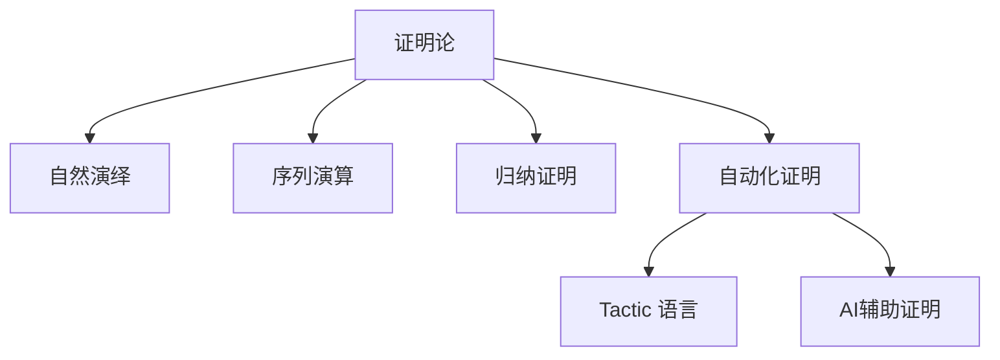

# 1.9 证明论与推理系统 / Proof Theory and Reasoning Systems

[返回目录](../CONTINUOUS_PROGRESS.md) | [上一节: 1.8-类型论理论模型.md](1.8-类型论理论模型.md)

---

## 1.9.1 证明论发展简史 / Historical Overview of Proof Theory

### 历史发展脉络 / Historical Development Timeline

**早期发展（1900-1950）**：

- **1900年**：Hilbert提出形式化数学纲领
- **1920年代**：Gentzen发展自然演绎系统
- **1930年代**：Gentzen提出序列演算
- **1940年代**：Church发展λ演算和类型论

**现代发展（1950-2000）**：

- **1960年代**：Martin-Löf发展直觉类型理论
- **1970年代**：Coquand和Huet发展构造演算
- **1980年代**：自动化证明系统的发展
- **1990年代**：定理证明器的广泛应用

**当代发展（2000-至今）**：

- **2000年代**：同伦类型论和证明助手
- **2010年代**：AI辅助证明和自动化
- **2020年代**：大规模形式化验证

### 核心理论体系 / Core Theoretical Systems

**自然演绎系统**：

```lean
-- 自然演绎的形式化
inductive NaturalDeduction where
  | assumption : Prop → NaturalDeduction
  | implication_intro : NaturalDeduction → NaturalDeduction
  | implication_elim : NaturalDeduction → NaturalDeduction → NaturalDeduction
  | conjunction_intro : NaturalDeduction → NaturalDeduction → NaturalDeduction
  | conjunction_elim_left : NaturalDeduction → NaturalDeduction
  | conjunction_elim_right : NaturalDeduction → NaturalDeduction
  | disjunction_intro_left : NaturalDeduction → NaturalDeduction
  | disjunction_intro_right : NaturalDeduction → NaturalDeduction
  | disjunction_elim : NaturalDeduction → NaturalDeduction → NaturalDeduction → NaturalDeduction
```

**序列演算系统**：

```lean
-- 序列演算的形式化
structure Sequent (Γ Δ : List Prop) where
  left : List Prop  -- 假设
  right : List Prop -- 结论

inductive SequentCalculus where
  | axiom : Prop → SequentCalculus
  | cut : SequentCalculus → SequentCalculus → SequentCalculus
  | left_and : SequentCalculus → SequentCalculus
  | right_and : SequentCalculus → SequentCalculus
  | left_or : SequentCalculus → SequentCalculus
  | right_or : SequentCalculus → SequentCalculus
  | left_implies : SequentCalculus → SequentCalculus
  | right_implies : SequentCalculus → SequentCalculus
```

### 理论影响与应用 / Theoretical Impact and Applications

**定理证明器发展**：

- **Lean**：基于依赖类型理论的现代证明器
- **Coq**：基于构造演算的经典证明器
- **Agda**：基于Martin-Löf类型理论的证明器
- **Isabelle**：基于高阶逻辑的证明器

**形式化方法应用**：

- **软件验证**：程序正确性证明
- **硬件验证**：数字电路验证
- **协议验证**：安全协议验证
- **数学形式化**：数学定理的形式化证明

**教育应用**：

- **逻辑教学**：形式逻辑的教学工具
- **证明训练**：数学证明的训练平台
- **计算机科学教育**：形式化方法的教学

---

## 1.9.2 自然演绎与序列演算 / Natural Deduction and Sequent Calculus

### 自然演绎（Natural Deduction） / Natural Deduction

**基本概念**：

- **引入规则**：从假设推导出新命题的规则
- **消解规则**：使用已知命题推导出结论的规则
- **证明树**：以树形结构表示证明过程
- **直觉推理**：模拟人类自然推理过程

**自然演绎规则**：

```lean
-- 自然演绎的形式化实现
inductive NaturalDeduction where
  -- 假设规则
  | assumption : Prop → NaturalDeduction
  
  -- 蕴含规则
  | implication_intro : NaturalDeduction → NaturalDeduction
  | implication_elim : NaturalDeduction → NaturalDeduction → NaturalDeduction
  
  -- 合取规则
  | conjunction_intro : NaturalDeduction → NaturalDeduction → NaturalDeduction
  | conjunction_elim_left : NaturalDeduction → NaturalDeduction
  | conjunction_elim_right : NaturalDeduction → NaturalDeduction
  
  -- 析取规则
  | disjunction_intro_left : NaturalDeduction → NaturalDeduction
  | disjunction_intro_right : NaturalDeduction → NaturalDeduction
  | disjunction_elim : NaturalDeduction → NaturalDeduction → NaturalDeduction → NaturalDeduction
  
  -- 否定规则
  | negation_intro : NaturalDeduction → NaturalDeduction
  | negation_elim : NaturalDeduction → NaturalDeduction → NaturalDeduction
  | contradiction : NaturalDeduction → NaturalDeduction → NaturalDeduction
```

**自然演绎示例**：

```lean
-- 蕴含传递律的证明
lemma imp_trans (A B C : Prop) : (A → B) → (B → C) → (A → C) := by
  intro h₁ h₂ a
  apply h₂
  apply h₁
  exact a

-- 等价于以下自然演绎证明：
-- 1. 假设 A → B
-- 2. 假设 B → C  
-- 3. 假设 A
-- 4. 从1和3，应用蕴含消解得到 B
-- 5. 从2和4，应用蕴含消解得到 C
-- 6. 从3-5，应用蕴含引入得到 A → C
-- 7. 从2-6，应用蕴含引入得到 (B → C) → (A → C)
-- 8. 从1-7，应用蕴含引入得到 (A → B) → (B → C) → (A → C)
```

### 序列演算（Sequent Calculus） / Sequent Calculus

**基本概念**：

- **序列**：形如 $\Gamma \vdash \Delta$ 的表达式
- **结构规则**：交换、收缩、弱化等规则
- **逻辑规则**：左右规则对应逻辑连接词
- **归约过程**：从结论向假设的归约

**序列演算形式化**：

```lean
-- 序列的定义
structure Sequent (Γ Δ : List Prop) where
  left : List Prop   -- 假设集合 Γ
  right : List Prop  -- 结论集合 Δ

-- 序列演算规则
inductive SequentCalculus where
  -- 公理规则
  | axiom : Prop → SequentCalculus
  
  -- 结构规则
  | exchange_left : SequentCalculus → SequentCalculus
  | exchange_right : SequentCalculus → SequentCalculus
  | contraction_left : SequentCalculus → SequentCalculus
  | contraction_right : SequentCalculus → SequentCalculus
  | weakening_left : SequentCalculus → SequentCalculus
  | weakening_right : SequentCalculus → SequentCalculus
  
  -- 逻辑规则
  | left_and : SequentCalculus → SequentCalculus
  | right_and : SequentCalculus → SequentCalculus
  | left_or : SequentCalculus → SequentCalculus
  | right_or : SequentCalculus → SequentCalculus
  | left_implies : SequentCalculus → SequentCalculus
  | right_implies : SequentCalculus → SequentCalculus
  
  -- 切割规则
  | cut : SequentCalculus → SequentCalculus → SequentCalculus
```

**序列演算示例**：

```lean
-- 序列演算中的证明示例
def sequent_proof_example : Sequent [A, B] [C] :=
  -- 这是一个序列演算证明的框架
  -- 实际实现需要更复杂的证明结构
  ⟨[A, B], [C]⟩

-- 序列演算的归约过程
def sequent_reduction (seq : Sequent Γ Δ) : List Sequent :=
  -- 从结论向假设的归约过程
  match seq.right with
  | [] => [seq]  -- 无结论，停止归约
  | φ :: rest => 
    -- 对结论中的每个公式应用相应的右规则
    match φ with
    | And p q => [Sequent Γ (p :: q :: rest)]
    | Or p q => [Sequent Γ (p :: rest), Sequent Γ (q :: rest)]
    | Implies p q => [Sequent (p :: Γ) (q :: rest)]
    | _ => [seq]
    end
```

### 自然演绎与序列演算对比 / Comparison between Natural Deduction and Sequent Calculus

**证明结构对比**：

```lean
-- 自然演绎：自下而上的证明构建
def natural_deduction_proof (goal : Prop) : NaturalDeduction :=
  -- 从目标开始，逐步应用引入规则
  match goal with
  | Implies A B => 
    NaturalDeduction.implication_intro 
      (natural_deduction_proof B)
  | And A B => 
    NaturalDeduction.conjunction_intro 
      (natural_deduction_proof A) 
      (natural_deduction_proof B)
  | _ => NaturalDeduction.assumption goal
  end

-- 序列演算：自上而下的证明搜索
def sequent_calculus_proof (sequent : Sequent Γ Δ) : SequentCalculus :=
  -- 从序列开始，逐步应用左右规则
  match sequent.right with
  | [] => SequentCalculus.axiom (sequent.left.head)
  | φ :: rest => 
    match φ with
    | Implies A B => 
      SequentCalculus.right_implies 
        (sequent_calculus_proof (Sequent (A :: sequent.left) (B :: rest)))
    | And A B => 
      SequentCalculus.right_and 
        (sequent_calculus_proof (Sequent sequent.left (A :: B :: rest)))
    | _ => SequentCalculus.axiom φ
    end
  end
```

**应用场景对比**：

- **自然演绎**：适合直觉推理、教学、人类可读的证明
- **序列演算**：适合自动化证明、证明搜索、理论分析

---

## 1.9.3 归纳证明与递归原理 / Inductive Proofs and Recursion Principle

- 数学归纳法、结构归纳法广泛用于自然数、数据结构等的性质证明
- Lean 支持递归定义与归纳证明

**Lean 代码示例：**

```lean
lemma add_zero (n : Nat) : n + 0 = n :=
  Nat.recOn n rfl (λ n ih => congrArg Nat.succ ih)
```

---

## 1.9.4 自动化证明与策略 / Automated Proofs and Tactics

- Lean 的 tactic 语言支持自动化证明、归纳、化简、搜索等
- 用户可自定义 tactic 组合，实现高效证明

**Lean 代码示例：**

```lean
example (a b : Nat) : a + b = b + a :=
  by simp [Nat.add_comm]
```

---

## 1.9.5 Lean中的证明系统与创新 / Proof Systems and Innovations in Lean

- 支持自然演绎、序列演算、归纳证明、自动化策略等多种体系
- AI辅助证明、可解释性证明、证明可视化等前沿方向
- 与Coq、Agda等系统的证明机制对比

---

## 1.9.6 图表与多表征 / Diagrams and Multi-Representation



---

## 1.9.6 创新建议 / Innovation Suggestions

- 中文：探索AI驱动的自动化证明、神经符号推理、交互式证明可视化等新方向。
- English: Explore new directions such as AI-driven automated proofs, neuro-symbolic reasoning, and interactive proof visualization.

## 1.9.7 工程案例 / Engineering Case

- 中文：在工业级安全协议验证、复杂系统归纳证明自动化等领域的应用。
- English: Applications in industrial-grade security protocol verification and automation of inductive proofs for complex systems.

## 1.9.8 前沿趋势 / Frontiers and Trends

- 中文：大模型辅助证明、证明搜索优化、自动化策略生成。
- English: Large language model-assisted proofs, proof search optimization, and automated strategy generation.

## 1.9.9 AI辅助与多模态表达 / AI Assistance and Multi-Modal Representation

- 中文：结合AI自动生成证明脚本、可视化证明树，支持Latex、Mermaid、Lean/Coq代码多模态表达。
- English: Integrate AI to automatically generate proof scripts and visualize proof trees, supporting multi-modal representation with Latex, Mermaid, and Lean/Coq code.

---

## 1.9.7 交叉引用 / Cross References

- [1.2-lean-类型系统与证明系统.md](1.2-lean-类型系统与证明系统.md)
- [1.8-类型论理论模型.md](1.8-类型论理论模型.md)
- [1.10-模型论与语义模型.md](1.10-模型论与语义模型.md)

## 1.9.10 证明论的语义基础 / Semantic Foundations of Proof Theory

- 中文：证明论关注形式系统中证明结构的语义解释，包括命题、推理规则与证明对象的对应关系。
- English: Proof theory focuses on the semantic interpretation of proof structures in formal systems, including the correspondence between propositions, inference rules, and proof objects.

## 1.9.11 Lean中的自然演绎与序列演算 / Natural Deduction & Sequent Calculus in Lean

- 中文：Lean 支持自然演绎与序列演算的形式化建模，可通过 inductive 类型和 tactic 语言实现推理规则与证明树。
- English: Lean supports formal modeling of natural deduction and sequent calculus, using inductive types and tactics to implement inference rules and proof trees.

**Lean 代码示例 / Lean Code Example**：

```lean
inductive Sequent : Type
| ax : Prop → Sequent
| cut : Sequent → Sequent → Sequent
```

## 1.9.12 归纳与共递归证明 / Inductive & Coinductive Proofs

- 中文：Lean 支持归纳法和共递归法的形式化证明，广泛用于自然数、数据结构等。
- English: Lean supports formal proofs by induction and coinduction, widely used for natural numbers, data structures, etc.

## 1.9.13 证明自动化与AI辅助 / Proof Automation & AI Assistance

- 中文：Lean 的 tactic 语言和 AI 工具可自动生成证明脚本，提升证明效率。
- English: Lean's tactic language and AI tools can automatically generate proof scripts, improving proof efficiency.

## 1.9.14 证明等价与规范化 / Proof Equivalence & Normalization

- 中文：Lean 可形式化证明等价性、归约与规范化，支持证明对象的唯一性分析。
- English: Lean can formalize proof equivalence, reduction, and normalization, supporting uniqueness analysis of proof objects.

## 1.9.15 证明复杂性分析 / Proof Complexity Analysis

- 中文：Lean 支持证明复杂性、最短证明、自动化策略复杂度等分析。
- English: Lean supports analysis of proof complexity, shortest proofs, and complexity of automated strategies.

## 1.9.16 可视化证明树 / Visual Proof Trees

- 中文：Lean 可结合 Mermaid/AI 工具自动生成证明树的可视化图示，提升可解释性。
- English: Lean can use Mermaid/AI tools to automatically generate visualizations of proof trees, improving explainability.

## 1.9.17 与模型论/类型论/范畴论的交互 / Interaction with Model Theory, Type Theory, and Category Theory

- 中文：Lean 支持证明论与模型论、类型论、范畴论的交互建模，实现理论统一与创新应用。
- English: Lean supports interactive modeling between proof theory, model theory, type theory, and category theory, enabling theoretical unification and innovative applications.

---

## 1.9.18 2025 规范对齐 / Alignment with Lean 4 (2025)

- 证明脚本：结构化 `by`，自定义战术以 `elab ... : tactic` 实现；控制自动化搜索的复杂度与可解释性。
- 归纳/递归：结构归纳优先；良基递归需显式 `termination_by`/`decreasing_by`；归纳引理纳入 `simp`。
- 与语义的衔接：可计算部分与 `Prop` 级证明分离；证明等价/规范化等性质以定理呈现。

---

## 1.9.19 版本兼容性 / Version Compatibility

- Lean 3 → Lean 4：tactic/Meta/Elab API 迁移；引号与准引号 `(tactic| ...)`/`(term| ...)` 用于生成语法对象。

---

## 1.9.20 参考资料 / References

- Lean 4 Reference Manual（Proofs/Tactics/Meta/Elab）
- 证明论教材与序列演算/自然演绎文献
- Mathlib4 自动化策略文档

---

## 本地导航 / Local Navigation

- 上一节：`1.8-类型论理论模型.md`
- 返回：`1.9-证明论与推理系统.md`
- 全局：`INDEX.md` | `CONTENT_STANDARDS.md` | `CONTINUOUS_PROGRESS.md`