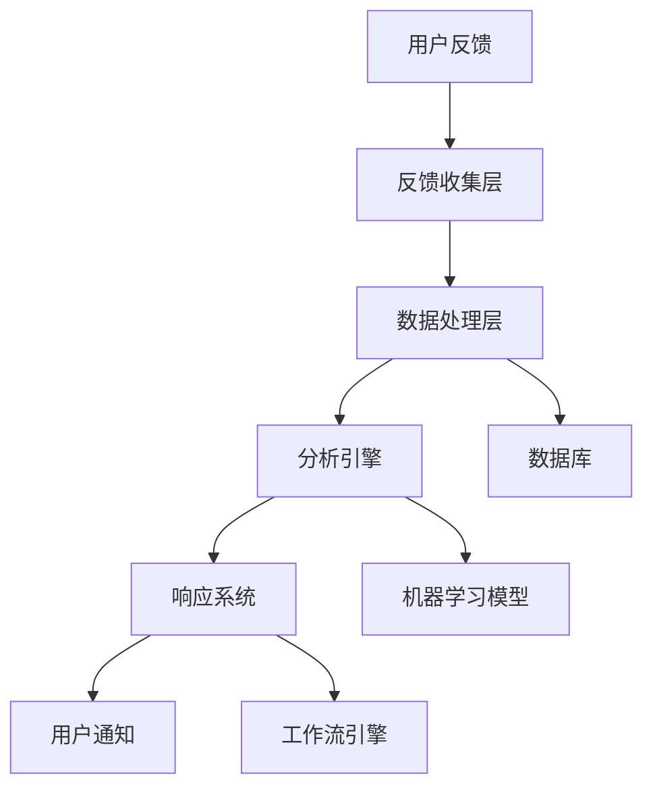

# 6.2 反馈系统 / Feedback System

[返回目录](README.md) | [上一节](6.1-贡献指南.md) | [下一节](6.3-协作平台.md)

---

## 概述 / Overview

反馈系统是Lean语义文档库项目的重要组成部分，为用户提供问题报告、功能请求、改进建议、用户反馈等功能。我们建立了完整的反馈收集、处理、响应机制，确保用户的声音能够被听到并得到及时回应。

## 1. 反馈类型 / Types of Feedback

### 1.1 问题报告 / Issue Reports

**类型 1.1.1** (Bug报告) 错误和问题报告：

- **文档错误**：文档中的错误、不准确信息、格式问题
- **链接错误**：无效链接、断链、跳转错误
- **内容问题**：内容缺失、重复、不一致
- **技术问题**：代码示例错误、编译问题、语法错误

**类型 1.1.2** (系统问题) 系统和技术问题：

- **性能问题**：加载缓慢、响应延迟、资源占用
- **兼容性问题**：浏览器兼容性、设备兼容性
- **功能问题**：功能不工作、功能缺失、功能异常
- **安全问题**：安全漏洞、权限问题、数据泄露

### 1.2 功能请求 / Feature Requests

**类型 1.2.1** (新功能) 新功能请求：

- **文档功能**：新的文档类型、格式、组织方式
- **搜索功能**：高级搜索、智能搜索、个性化搜索
- **导航功能**：改进导航、快速跳转、书签功能
- **交互功能**：用户交互、评论系统、评分系统

**类型 1.2.2** (改进功能) 现有功能改进：

- **界面改进**：用户界面优化、用户体验提升
- **性能改进**：加载速度、响应时间、资源优化
- **功能增强**：现有功能扩展、功能完善
- **兼容性改进**：跨平台兼容、设备适配

### 1.3 改进建议 / Improvement Suggestions

**类型 1.3.1** (内容建议) 内容改进建议：

- **内容完善**：补充缺失内容、完善现有内容
- **结构优化**：文档结构、组织方式、分类方法
- **质量提升**：内容质量、准确性、可读性
- **更新建议**：内容更新、版本升级、信息同步

**类型 1.3.2** (流程建议) 流程改进建议：

- **工作流程**：开发流程、发布流程、维护流程
- **协作流程**：团队协作、沟通机制、决策流程
- **质量流程**：质量控制、审查流程、测试流程
- **用户流程**：用户参与、反馈处理、问题解决

## 2. 反馈渠道 / Feedback Channels

### 2.1 在线反馈 / Online Feedback

**渠道 2.1.1** (GitHub Issues) GitHub问题跟踪：

```markdown
# 问题报告模板
## 问题描述
简要描述遇到的问题

## 重现步骤
1. 访问页面
2. 执行操作
3. 观察结果

## 期望行为
描述期望的正确行为

## 实际行为
描述实际发生的行为

## 环境信息
- 操作系统：
- 浏览器：
- 版本：
- 设备：

## 附加信息
任何其他相关信息
```

**渠道 2.1.2** (反馈表单) 在线反馈表单：

- **问题报告表单**：结构化的问题报告
- **功能请求表单**：详细的功能请求
- **改进建议表单**：具体的改进建议
- **用户满意度调查**：用户体验评估

### 2.2 社区反馈 / Community Feedback

**渠道 2.2.1** (讨论论坛) 社区讨论：

- **技术讨论**：技术问题讨论和解答
- **功能讨论**：功能需求讨论和投票
- **改进讨论**：改进建议讨论和评估
- **用户交流**：用户经验分享和交流

**渠道 2.2.2** (即时聊天) 实时交流：

- **Zulip聊天**：实时技术讨论
- **Discord服务器**：社区交流平台
- **Slack工作区**：团队协作交流
- **Telegram群组**：移动端交流

### 2.3 直接反馈 / Direct Feedback

**渠道 2.3.1** (邮件反馈) 邮件联系：

- **技术支持邮件**：技术问题支持
- **功能请求邮件**：功能需求提交
- **合作邮件**：合作和贡献
- **媒体联系邮件**：媒体和宣传

**渠道 2.3.2** (会议反馈) 面对面交流：

- **社区会议**：定期社区会议
- **技术会议**：技术分享会议
- **用户会议**：用户反馈会议
- **开发者会议**：开发者交流会议

## 3. 反馈处理流程 / Feedback Processing Workflow

### 3.1 反馈收集 / Feedback Collection

**步骤 3.1.1** (自动收集) 自动反馈收集：

```json
{
  "feedback_collection": {
    "automated": {
      "error_tracking": true,
      "usage_analytics": true,
      "performance_monitoring": true,
      "user_behavior_tracking": true
    },
    "manual": {
      "issue_reports": true,
      "feature_requests": true,
      "improvement_suggestions": true,
      "user_surveys": true
    }
  }
}
```

**步骤 3.1.2** (分类整理) 反馈分类整理：

- **自动分类**：使用机器学习自动分类
- **手动分类**：人工审核和分类
- **优先级评估**：评估反馈的重要性和紧急程度
- **标签管理**：为反馈添加标签和分类

### 3.2 反馈分析 / Feedback Analysis

**步骤 3.2.1** (数据分析) 反馈数据分析：

```python
# 反馈分析示例
def analyze_feedback(feedback_data):
    # 情感分析
    sentiment = analyze_sentiment(feedback_data.text)
    
    # 主题分析
    topics = extract_topics(feedback_data.text)
    
    # 优先级评估
    priority = assess_priority(feedback_data)
    
    # 相似性分析
    similar_feedback = find_similar(feedback_data)
    
    return {
        'sentiment': sentiment,
        'topics': topics,
        'priority': priority,
        'similar_feedback': similar_feedback
    }
```

**步骤 3.2.2** (趋势分析) 反馈趋势分析：

- **时间趋势**：反馈数量和时间的关系
- **主题趋势**：热门话题和关注点变化
- **用户趋势**：用户行为和偏好变化
- **质量趋势**：反馈质量和满意度变化

### 3.3 反馈响应 / Feedback Response

**步骤 3.3.1** (自动响应) 自动响应机制：

```json
{
  "auto_response": {
    "acknowledgment": {
      "enabled": true,
      "template": "感谢您的反馈，我们已收到并正在处理。",
      "response_time": "< 1 hour"
    },
    "classification": {
      "enabled": true,
      "categories": ["bug", "feature", "improvement", "question"],
      "confidence_threshold": 0.8
    },
    "routing": {
      "enabled": true,
      "rules": [
        {
          "condition": "category == 'bug'",
          "action": "assign_to_technical_team"
        },
        {
          "condition": "category == 'feature'",
          "action": "assign_to_product_team"
        }
      ]
    }
  }
}
```

**步骤 3.3.2** (人工响应) 人工响应处理：

- **专业回复**：技术团队专业回复
- **进度更新**：定期更新处理进度
- **解决方案**：提供具体解决方案
- **后续跟进**：问题解决后的跟进

## 4. 反馈管理系统 / Feedback Management System

### 4.1 系统架构 / System Architecture

**架构 4.1.1** (技术架构) 反馈管理系统架构：



**架构 4.1.2** (数据流) 数据流设计：

- **输入层**：多渠道反馈输入
- **处理层**：数据清洗和标准化
- **分析层**：智能分析和分类
- **输出层**：响应和通知
- **存储层**：数据持久化存储

### 4.2 功能模块 / Functional Modules

**模块 4.2.1** (收集模块) 反馈收集模块：

```python
class FeedbackCollector:
    def __init__(self):
        self.channels = {
            'github': GitHubCollector(),
            'form': FormCollector(),
            'email': EmailCollector(),
            'chat': ChatCollector()
        }
    
    def collect_feedback(self, channel, data):
        collector = self.channels[channel]
        return collector.process(data)
    
    def validate_feedback(self, feedback):
        # 验证反馈数据的完整性和有效性
        return self.validator.validate(feedback)
```

**模块 4.2.2** (分析模块) 反馈分析模块：

```python
class FeedbackAnalyzer:
    def __init__(self):
        self.sentiment_analyzer = SentimentAnalyzer()
        self.topic_extractor = TopicExtractor()
        self.priority_assessor = PriorityAssessor()
    
    def analyze(self, feedback):
        analysis = {
            'sentiment': self.sentiment_analyzer.analyze(feedback.text),
            'topics': self.topic_extractor.extract(feedback.text),
            'priority': self.priority_assessor.assess(feedback),
            'similarity': self.find_similar(feedback)
        }
        return analysis
```

## 5. 反馈质量保证 / Feedback Quality Assurance

### 5.1 质量标准 / Quality Standards

**标准 5.1.1** (反馈质量) 反馈质量标准：

- **完整性**：反馈信息完整、详细
- **准确性**：反馈内容准确、真实
- **相关性**：反馈与项目相关、有用
- **及时性**：反馈及时、响应迅速

**标准 5.1.2** (处理质量) 处理质量标准：

- **响应时间**：24小时内响应
- **解决时间**：根据优先级设定解决时间
- **解决率**：90%以上的问题得到解决
- **满意度**：用户满意度达到85%以上

### 5.2 质量监控 / Quality Monitoring

**监控 5.2.1** (实时监控) 实时质量监控：

```json
{
  "quality_metrics": {
    "response_time": {
      "target": "< 24 hours",
      "current": "18 hours",
      "status": "good"
    },
    "resolution_rate": {
      "target": "> 90%",
      "current": "92%",
      "status": "good"
    },
    "user_satisfaction": {
      "target": "> 85%",
      "current": "87%",
      "status": "good"
    }
  }
}
```

**监控 5.2.2** (定期评估) 定期质量评估：

- **月度评估**：每月评估反馈处理质量
- **季度评估**：每季度评估系统改进效果
- **年度评估**：每年评估整体用户满意度
- **持续改进**：基于评估结果持续改进

## 6. 用户参与机制 / User Participation Mechanism

### 6.1 参与方式 / Participation Methods

**方式 6.1.1** (主动参与) 主动参与方式：

- **问题报告**：主动报告发现的问题
- **功能建议**：提出新功能建议
- **内容贡献**：贡献文档和内容
- **测试参与**：参与测试和验证

**方式 6.1.2** (被动参与) 被动参与方式：

- **使用反馈**：使用过程中的自然反馈
- **行为数据**：使用行为数据分析
- **满意度调查**：定期满意度调查
- **用户访谈**：深度用户访谈

### 6.2 激励机制 / Incentive Mechanism

**机制 6.2.1** (认可机制) 用户认可机制：

- **贡献者名单**：在项目中列出贡献者
- **贡献统计**：统计和展示用户贡献
- **贡献证书**：为活跃用户颁发证书
- **社区地位**：提升用户在社区中的地位

**机制 6.2.2** (奖励机制) 用户奖励机制：

- **积分系统**：为反馈贡献积累积分
- **等级系统**：根据贡献设置用户等级
- **特权系统**：为高级用户提供特权
- **礼品系统**：为贡献者提供小礼品

## 7. 反馈数据管理 / Feedback Data Management

### 7.1 数据收集 / Data Collection

**收集 7.1.1** (数据来源) 反馈数据来源：

- **直接反馈**：用户直接提交的反馈
- **间接反馈**：通过行为分析获得的反馈
- **第三方数据**：来自第三方平台的数据
- **历史数据**：历史反馈和趋势数据

**收集 7.1.2** (数据格式) 数据格式标准：

```json
{
  "feedback": {
    "id": "unique_id",
    "timestamp": "2025-01-01T00:00:00Z",
    "type": "bug|feature|improvement|question",
    "priority": "low|medium|high|critical",
    "category": "documentation|technical|ui|performance",
    "user": {
      "id": "user_id",
      "email": "user@example.com",
      "role": "user|contributor|maintainer"
    },
    "content": {
      "title": "反馈标题",
      "description": "详细描述",
      "steps": "重现步骤",
      "expected": "期望结果",
      "actual": "实际结果"
    },
    "metadata": {
      "browser": "Chrome 120",
      "os": "Windows 11",
      "device": "desktop",
      "url": "https://example.com/page"
    }
  }
}
```

### 7.2 数据存储 / Data Storage

**存储 7.2.1** (存储策略) 数据存储策略：

- **分层存储**：根据数据重要性分层存储
- **备份策略**：定期备份重要数据
- **归档策略**：长期归档历史数据
- **清理策略**：定期清理过期数据

**存储 7.2.2** (数据安全) 数据安全保护：

- **访问控制**：严格的访问权限控制
- **数据加密**：敏感数据加密存储
- **隐私保护**：保护用户隐私信息
- **合规性**：符合数据保护法规

## 8. 反馈系统优化 / Feedback System Optimization

### 8.1 性能优化 / Performance Optimization

**优化 8.1.1** (响应优化) 系统响应优化：

- **缓存机制**：使用缓存提高响应速度
- **负载均衡**：分散负载提高系统稳定性
- **数据库优化**：优化数据库查询性能
- **CDN加速**：使用CDN加速内容分发

**优化 8.1.2** (用户体验优化) 用户体验优化：

- **界面优化**：优化用户界面和交互
- **流程简化**：简化反馈提交流程
- **智能提示**：提供智能提示和帮助
- **个性化**：提供个性化用户体验

### 8.2 功能扩展 / Feature Extension

**扩展 8.2.1** (新功能) 新功能开发：

- **AI辅助**：使用AI辅助反馈分析
- **自动化**：提高反馈处理自动化程度
- **集成**：与其他系统集成
- **移动端**：开发移动端应用

**扩展 8.2.2** (功能增强) 现有功能增强：

- **搜索功能**：增强搜索和过滤功能
- **分析功能**：增强数据分析功能
- **通知功能**：增强通知和提醒功能
- **协作功能**：增强团队协作功能

## 9. 总结与展望 / Summary and Outlook

### 9.1 系统价值 / System Value

**价值 9.1.1** (用户价值) 用户价值体现：

- **问题解决**：快速解决用户问题
- **需求满足**：满足用户功能需求
- **体验提升**：提升用户体验
- **参与感**：增强用户参与感

**价值 9.1.2** (项目价值) 项目价值体现：

- **质量提升**：提升项目质量
- **功能完善**：完善项目功能
- **用户增长**：促进用户增长
- **社区建设**：建设活跃社区

### 9.2 发展方向 / Development Directions

**方向 9.2.1** (技术发展) 技术发展方向：

- **智能化**：提高系统智能化程度
- **自动化**：提高处理自动化程度
- **集成化**：与其他系统深度集成
- **移动化**：支持移动端使用

**方向 9.2.2** (功能发展) 功能发展方向：

- **个性化**：提供个性化服务
- **社交化**：增强社交功能
- **游戏化**：增加游戏化元素
- **国际化**：支持多语言和国际化

---

## 交叉引用 / Cross-References

- **上一节**：[6.1 贡献指南](6.1-贡献指南.md)
- **下一节**：[6.3 协作平台](6.3-协作平台.md)
- **上位主题**：[6. 社区资源](README.md)

---

*最后更新：2025-01-01*  
*版本：v2025-01*  
*状态：已完成 ✅*
