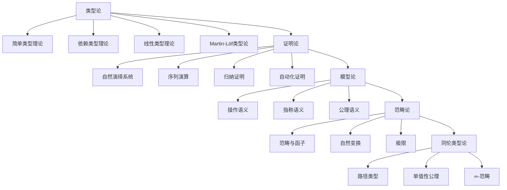

# 交叉引用系统 / Cross-Reference System

[返回目录](./README.md) | [上下文系统](./CONTINUOUS_CONTEXT_SYSTEM.md) | [目录结构修正](./DIRECTORY_STRUCTURE_FIX_PLAN.md)

---

## 概述 / Overview

本文档建立了完整的内容相关性链接和本地跳转系统，确保所有文档之间的关联关系清晰明确，支持用户快速导航和查找相关信息。

## 1. 交叉引用架构 / Cross-Reference Architecture

### 1.1 引用层次结构 / Reference Hierarchy

**三层引用体系**:

1. **文档级引用**: 文档之间的直接关联
2. **章节级引用**: 章节之间的逻辑关联
3. **概念级引用**: 概念之间的语义关联

### 1.2 引用类型分类 / Reference Type Classification

**引用类型**:

- **前置引用**: 引用前面章节的内容
- **后置引用**: 引用后面章节的内容
- **交叉引用**: 引用其他文档的内容
- **概念引用**: 引用相关概念和定义

## 2. 本地跳转系统 / Local Navigation System

### 2.1 标准跳转格式 / Standard Navigation Format

**标准格式**:

```markdown
[返回目录](../README.md) | [上一节](previous-section.md) | [下一节](next-section.md)
```

**示例**:

```markdown
[返回目录](../README.md) | [上一节](1.8.2-依赖类型理论.md) | [下一节](1.8.4-Martin-Löf类型论.md)
```

### 2.2 跳转链接规范 / Navigation Link Standards

**链接规范**:

1. **相对路径**: 使用相对路径确保可移植性
2. **文件名一致**: 文件名与标题保持一致
3. **路径正确**: 确保所有路径指向正确文件
4. **格式统一**: 所有跳转链接使用统一格式

## 3. 概念索引系统 / Concept Index System

### 3.1 核心概念索引 / Core Concept Index

**类型论概念**:

- [简单类型理论](1-lean-grammar-and-semantics/1.8.1-简单类型理论.md)
- [依赖类型理论](1-lean-grammar-and-semantics/1.8.2-依赖类型理论.md)
- [线性类型理论](1-lean-grammar-and-semantics/1.8.3-线性类型理论.md)
- [Martin-Löf类型论](1-lean-grammar-and-semantics/1.8.4-Martin-Löf类型论.md)
- [Curry-Howard对应](1-lean-grammar-and-semantics/1.8.5-Curry-Howard对应.md)

**证明论概念**:

- [自然演绎系统](1-lean-grammar-and-semantics/1.9.1-自然演绎系统.md)
- [序列演算](1-lean-grammar-and-semantics/1.9.2-序列演算.md)
- [归纳证明与递归原理](1-lean-grammar-and-semantics/1.9.3-归纳证明与递归原理.md)
- [自动化证明与策略](1-lean-grammar-and-semantics/1.9.4-自动化证明与策略.md)

**模型论概念**:

- [操作语义](1-lean-grammar-and-semantics/1.10.1-操作语义.md)
- [指称语义](1-lean-grammar-and-semantics/1.10.2-指称语义.md)
- [公理语义](1-lean-grammar-and-semantics/1.10.3-公理语义.md)
- [语法-语义映射](1-lean-grammar-and-semantics/1.10.4-语法-语义映射.md)

**范畴论概念**:

- [范畴与函子](1-lean-grammar-and-semantics/1.11.1-范畴与函子.md)
- [自然变换与极限](1-lean-grammar-and-semantics/1.11.2-自然变换与极限.md)
- [Curry-Howard-Lambek对应](1-lean-grammar-and-semantics/1.11.3-Curry-Howard-Lambek对应.md)

**同伦类型论概念**:

- [路径类型与等价](1-lean-grammar-and-semantics/1.12.1-路径类型与等价.md)
- [单值性公理](1-lean-grammar-and-semantics/1.12.2-单值性公理.md)
- [高阶等价与∞-范畴](1-lean-grammar-and-semantics/1.12.3-高阶等价与∞-范畴.md)

### 3.2 主题关联索引 / Topic Association Index

**形式化理论主题**:

- [形式化理论统一框架](2-lean-形式化理论基础/2.1-形式化理论统一框架.md)
- [类型论与证明论基础](2-lean-形式化理论基础/2.2-类型论与证明论基础.md)
- [模型论与语义分析](2-lean-形式化理论基础/2.3-模型论与语义分析.md)
- [范畴论与类型理论](2-lean-形式化理论基础/2.4-范畴论与类型理论.md)
- [同伦类型论](2-lean-形式化理论基础/2.5-同伦类型论.md)

**学习路径主题**:

- [初学者学习路径](3-学习路径指南/3.1-初学者学习路径.md)
- [中级学习路径](3-学习路径指南/3.2-中级学习路径.md)

**工具集成主题**:

- [开发环境配置](5-工具集成指南/5.1-开发环境配置.md)
- [IDE集成](5-工具集成指南/5.2-IDE集成.md)
- [编译器配置](5-工具集成指南/5.3-编译器配置.md)
- [包管理](5-工具集成指南/5.4-包管理.md)
- [调试工具](5-工具集成指南/5.5-调试工具.md)
- [测试工具](5-工具集成指南/5.6-测试工具.md)
- [部署工具](5-工具集成指南/5.7-部署工具.md)

## 4. 交叉引用映射 / Cross-Reference Mapping

### 4.1 概念关系图 / Concept Relationship Diagram



### 4.2 文档依赖关系 / Document Dependency Relations

**依赖关系表**:

| 文档 | 依赖文档 | 关系类型 | 说明 |
|------|----------|----------|------|
| 1.8.2-依赖类型理论 | 1.8.1-简单类型理论 | 前置依赖 | 依赖类型基于简单类型 |
| 1.8.3-线性类型理论 | 1.8.2-依赖类型理论 | 前置依赖 | 线性类型扩展依赖类型 |
| 1.8.4-Martin-Löf类型论 | 1.8.2-依赖类型理论 | 前置依赖 | Martin-Löf是依赖类型的实现 |
| 1.8.5-Curry-Howard对应 | 1.8.4-Martin-Löf类型论 | 前置依赖 | 基于Martin-Löf类型论 |
| 1.9.1-自然演绎系统 | 1.8.5-Curry-Howard对应 | 前置依赖 | 基于类型-证明对应 |
| 1.10.1-操作语义 | 1.9.1-自然演绎系统 | 前置依赖 | 语义基于证明系统 |
| 1.11.1-范畴与函子 | 1.10.1-操作语义 | 前置依赖 | 范畴语义基于操作语义 |
| 1.12.1-路径类型与等价 | 1.11.1-范畴与函子 | 前置依赖 | 同伦类型基于范畴论 |

## 5. 智能导航系统 / Intelligent Navigation System

### 5.1 上下文感知导航 / Context-Aware Navigation

**导航规则**:

1. **学习路径导航**: 根据用户学习阶段提供相应导航
2. **概念关联导航**: 根据当前概念提供相关概念导航
3. **难度递进导航**: 根据内容难度提供递进式导航
4. **主题切换导航**: 支持不同主题间的快速切换

### 5.2 搜索与索引 / Search and Indexing

**搜索功能**:

- **全文搜索**: 支持文档内容的全文搜索
- **概念搜索**: 支持概念和定义的精确搜索
- **标签搜索**: 支持标签和分类的搜索
- **模糊搜索**: 支持模糊匹配的搜索

**索引结构**:

```text
索引系统/
├── 4.1-主题索引.md          # 按主题分类的索引
├── 4.2-概念索引.md          # 按概念分类的索引
├── 4.3-交叉引用索引.md      # 交叉引用关系索引
└── 4.4-快速查找指南.md      # 快速查找指南
```

## 6. 引用完整性检查 / Reference Integrity Check

### 6.1 链接有效性检查 / Link Validity Check

**检查项目**:

- [ ] 所有内部链接指向存在的文件
- [ ] 所有相对路径正确
- [ ] 所有锚点链接有效
- [ ] 所有交叉引用完整

### 6.2 引用一致性检查 / Reference Consistency Check

**检查项目**:

- [ ] 双向引用一致性
- [ ] 引用格式统一性
- [ ] 引用内容准确性
- [ ] 引用更新及时性

## 7. 自动化引用管理 / Automated Reference Management

### 7.1 引用生成工具 / Reference Generation Tools

**工具功能**:

```bash
# 生成交叉引用
./scripts/generate_cross_references.sh

# 检查链接完整性
./scripts/check_links.sh

# 更新引用索引
./scripts/update_reference_index.sh
```

### 7.2 引用维护脚本 / Reference Maintenance Scripts

**维护脚本**:

```bash
#!/bin/bash
# 引用维护脚本

# 1. 检查所有链接
check_links() {
    find . -name "*.md" -exec grep -l "\[.*\](.*)" {} \; | \
    xargs -I {} sh -c 'echo "Checking {}"; markdown-link-check {}'
}

# 2. 生成引用报告
generate_report() {
    echo "生成引用报告..."
    # 实现引用报告生成逻辑
}

# 3. 更新引用索引
update_index() {
    echo "更新引用索引..."
    # 实现索引更新逻辑
}

# 执行维护任务
main() {
    check_links
    generate_report
    update_index
}

main "$@"
```

## 8. 用户体验优化 / User Experience Optimization

### 8.1 导航便利性 / Navigation Convenience

**便利功能**:

1. **面包屑导航**: 显示当前位置的完整路径
2. **相关推荐**: 根据当前内容推荐相关内容
3. **快速跳转**: 支持快捷键快速跳转
4. **历史记录**: 记录浏览历史支持回退

### 8.2 内容发现 / Content Discovery

**发现机制**:

1. **标签系统**: 为内容添加标签便于分类
2. **推荐系统**: 基于用户行为推荐内容
3. **热门内容**: 显示热门和重要内容
4. **最新更新**: 显示最新更新的内容

## 9. 质量保证 / Quality Assurance

### 9.1 引用质量标准 / Reference Quality Standards

**质量要求**:

- **准确性**: 所有引用内容准确无误
- **完整性**: 引用关系完整无缺失
- **一致性**: 引用格式和风格一致
- **及时性**: 引用内容及时更新

### 9.2 质量检查流程 / Quality Check Process

**检查流程**:

1. **自动检查**: 使用脚本自动检查链接和引用
2. **人工审核**: 人工审核重要引用关系
3. **用户反馈**: 收集用户反馈改进引用系统
4. **持续改进**: 基于反馈持续改进引用质量

## 10. 未来发展方向 / Future Development Directions

### 10.1 技术升级 / Technical Upgrades

**升级方向**:

1. **智能推荐**: 基于AI的智能内容推荐
2. **语义搜索**: 基于语义的智能搜索
3. **可视化导航**: 图形化的导航界面
4. **个性化定制**: 个性化的导航体验

### 10.2 功能扩展 / Feature Extensions

**扩展功能**:

1. **多语言支持**: 支持多语言引用和导航
2. **移动端优化**: 优化移动端导航体验
3. **离线支持**: 支持离线浏览和导航
4. **协作功能**: 支持多人协作编辑引用

---

## 快速使用指南 / Quick Usage Guide

### 基本导航 / Basic Navigation

1. **使用目录**: 通过目录快速定位内容
2. **使用索引**: 通过索引查找相关概念
3. **使用搜索**: 通过搜索快速找到内容
4. **使用链接**: 通过链接跳转到相关内容

### 高级功能 / Advanced Features

1. **交叉引用**: 查看概念间的关联关系
2. **学习路径**: 按照学习路径系统学习
3. **工具集成**: 使用相关工具进行开发
4. **社区资源**: 访问社区资源获取帮助

---

**创建时间**: 2025-01-27  
**最后更新**: 2025-01-27  
**维护者**: AI Assistant

---

[返回目录](./README.md) | [上下文系统](./CONTINUOUS_CONTEXT_SYSTEM.md) | [目录结构修正](./DIRECTORY_STRUCTURE_FIX_PLAN.md)
